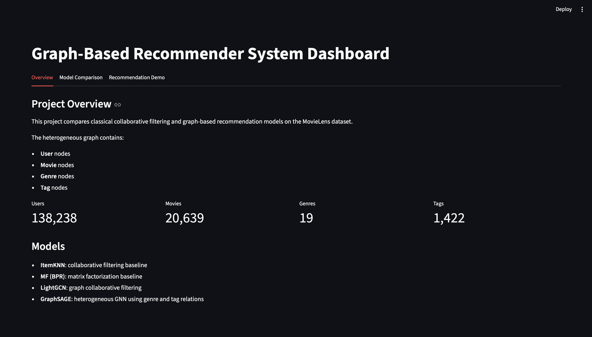
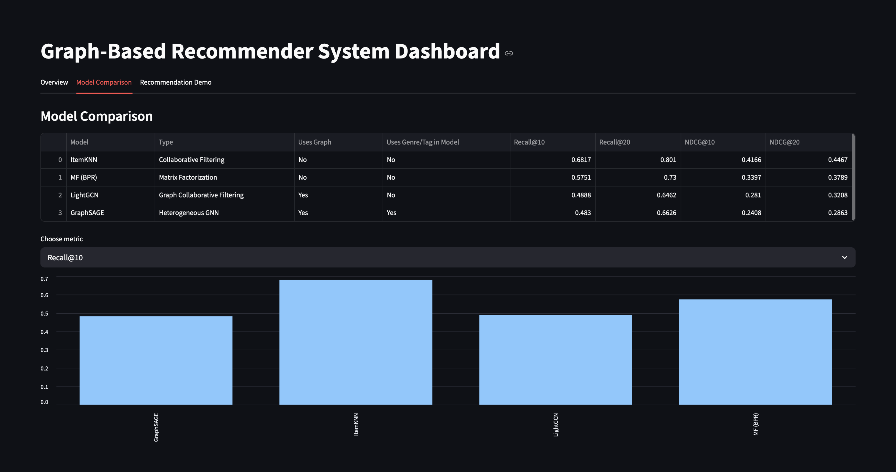
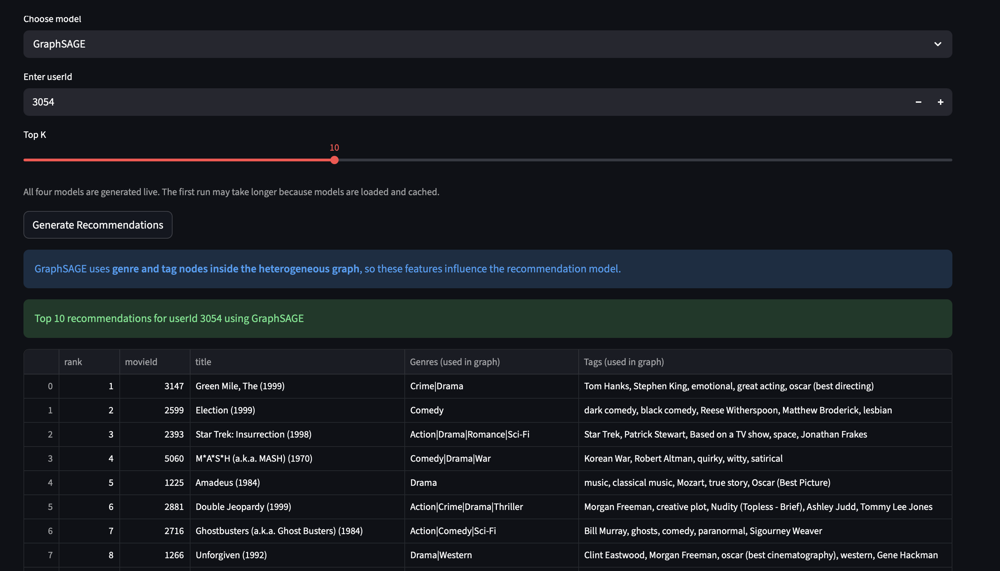

# 🎬 Graph-Based Recommender System with Domain-Specific Knowledge

A complete end-to-end movie recommendation system built using traditional collaborative filtering techniques and modern Graph Neural Networks (GNNs) on the MovieLens 20M dataset.

This project compares classical recommendation approaches such as ItemKNN and Matrix Factorization (MF-BPR) with graph-based deep learning models including LightGCN and GraphSAGE. The system also integrates domain-specific knowledge such as movie genres and tags using heterogeneous graph representations.

---

## 📌 Project Overview

Recommendation systems are a core component of modern platforms like Netflix, Amazon, Spotify, and YouTube. Their purpose is to reduce information overload by suggesting content that users are most likely to prefer.

In this project, I developed a large-scale movie recommendation system using the MovieLens 20M dataset containing:

- 20 Million+ ratings
- 138K+ users
- 27K+ movies
- 465K+ tag interactions

The project explores how graph-based learning can improve recommendation systems by modeling users, movies, genres, and tags as interconnected graph structures.

---

# 🚀 Objectives

The major goals of this project were:

- Build and compare multiple recommendation models
- Explore Graph Neural Networks for recommendation systems
- Incorporate domain-specific knowledge using genres and tags
- Evaluate ranking performance using recommendation metrics
- Deploy an interactive recommendation dashboard using Streamlit
- Store and share trained models using Hugging Face

---

# 🧠 Models Implemented

## 1️⃣ Item-Based Collaborative Filtering (ItemKNN)

- Traditional collaborative filtering approach
- Uses cosine similarity between movies
- Recommends movies similar to previously liked movies
- Strong baseline model for recommendation systems

### Key Characteristics
- Simple and interpretable
- Effective on dense interaction datasets
- Uses nearest-neighbor similarity

---

## 2️⃣ Matrix Factorization with Bayesian Personalized Ranking (MF-BPR)

- Learns latent embeddings for users and movies
- Optimized using pairwise ranking loss
- Captures hidden user preference patterns

### Training Configuration
- Embedding Dimension: 64
- Learning Rate: 0.001
- Epochs: 5

---

## 3️⃣ LightGCN (Graph Neural Network)

- Simplified Graph Convolutional Network for recommendation
- Uses user-item interaction graph
- Focuses on neighborhood aggregation

### Training Configuration
- Embedding Dimension: 128
- Propagation Layers: 3
- Learning Rate: 0.001
- Epochs: 15

---

## 4️⃣ GraphSAGE (Heterogeneous Graph Neural Network)

- Learns node embeddings through neighborhood aggregation
- Supports heterogeneous graphs
- Integrates:
  - Users
  - Movies
  - Genres
  - Tags

### Training Configuration
- Hidden Dimension: 128
- Layers: 3
- Dropout: 0.05
- Epochs: 15

---

# 📂 Dataset Used

## MovieLens 20M Dataset

The project uses the MovieLens 20M benchmark dataset released by GroupLens Research.

### Dataset Statistics

| Attribute | Value |
|---|---|
| Total Ratings | 20,000,263 |
| Total Users | 138,493 |
| Total Movies | 27,278 |
| Total Tag Applications | 465,564 |

### Files Used

- `ratings.csv`
- `movies.csv`
- `tags.csv`

---

# ⚙️ Data Preprocessing

The preprocessing pipeline included:

- Data cleaning
- Missing value handling
- Duplicate verification
- User and movie ID encoding
- Genre extraction
- Tag processing
- Graph construction

### Graph Components

#### Node Types
- Users
- Movies
- Genres
- Tags

#### Edge Types
- User → Movie
- Movie → Genre
- Movie → Tag

This graph representation enabled the models to capture both collaborative and semantic relationships.

---

# 📊 Evaluation Metrics

The recommendation models were evaluated using ranking-based metrics:

- Precision@10 / Precision@20
- Recall@10 / Recall@20
- NDCG@10 / NDCG@20
- HitRate@10 / HitRate@20

A leave-last-interaction-out strategy was used for testing.

Negative sampling was also applied using:
- 1 positive item
- 499 negative samples

---

# 📈 Experimental Results

| Model | Recall@10 | NDCG@10 | HitRate@10 |
|---|---|---|---|
| ItemKNN | 0.6817 | 0.4166 | 0.6817 |
| MF-BPR | 0.5751 | 0.3397 | 0.5751 |
| LightGCN | 0.4888 | 0.2810 | 0.4888 |
| GraphSAGE | 0.4888 | 0.2810 | 0.4888 |

---

# 🔍 Key Findings

## ✅ What I Achieved

- Built a complete recommendation system pipeline from preprocessing to deployment
- Successfully implemented and compared 4 recommendation models
- Constructed heterogeneous graphs using domain-specific knowledge
- Evaluated recommendation quality using ranking metrics
- Developed a real-time Streamlit recommendation dashboard
- Hosted trained models on Hugging Face for reproducibility

---

# 📚 What I Learned

Through this project, I gained hands-on experience in:

## Recommendation Systems
- Collaborative filtering techniques
- Ranking-based recommendation evaluation
- Latent factor models

## Graph Neural Networks
- LightGCN
- GraphSAGE
- Graph construction for recommender systems
- Node embeddings and neighborhood aggregation

## Machine Learning Engineering
- Large-scale data preprocessing
- Model evaluation pipelines
- Negative sampling strategies
- Hyperparameter tuning

## Deployment & Reproducibility
- Streamlit dashboard development
- Hugging Face model hosting
- Real-time recommendation generation

---

# 🖥️ Streamlit Dashboard

An interactive Streamlit application was developed to:

- Select recommendation models
- Enter User IDs
- Generate Top-K recommendations
- Compare outputs from different algorithms

### Dashboard Features
- Real-time recommendations
- Model comparison
- Top-10 and Top-20 movie recommendations
- Genre and tag visualization

# 🖥️ Streamlit Dashboard

## Dashboard Overview



---

## Model Comparison



---

## Recommendation Output



---

# 🤗 Model Hosting

All trained models were uploaded to Hugging Face for reproducibility and deployment.

Hosted models include:
- ItemKNN
- MF-BPR
- LightGCN
- GraphSAGE

# 🤗 Hugging Face Models

| Model | Hugging Face Link |
|---|---|
| ItemKNN | [View Model](https://huggingface.co/AnjaliBankapur/itemknn-movielens20m-baseline) |
| MF-BPR | [View Model](https://huggingface.co/AnjaliBankapur/mf-movielens20m-baseline) |
| LightGCN | [View Model](https://huggingface.co/AnjaliBankapur/lightgcn-movielens20m) |
| GraphSAGE | [View Model](https://huggingface.co/AnjaliBankapur/graphsage-movielens20m) |

---

# 🛠️ Tech Stack

## Languages & Libraries
- Python
- Pandas
- NumPy
- PyTorch
- PyTorch Geometric
- Scikit-learn

## Visualization & Deployment
- Streamlit
- Matplotlib

## Model Hosting
- Hugging Face

---

# 📁 Project Structure

```bash
├── data/
├── notebooks/
├── models/
├── streamlit_app/
├── preprocessing/
├── evaluation/
├── requirements.txt
└── README.md
